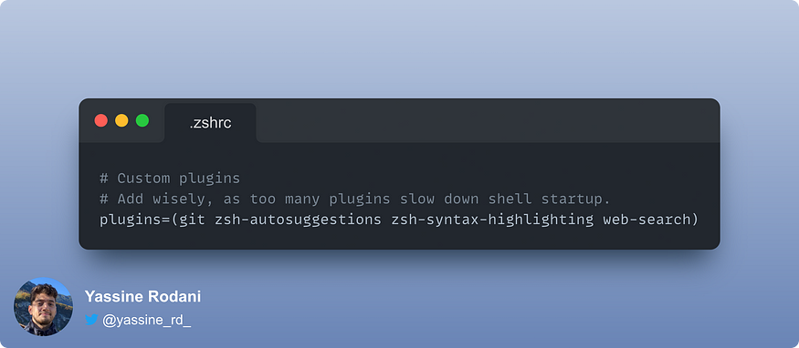

# General tricks for MAC terminal

Setup MAC:

## Setup Brew

```bash
/bin/bash -c "$(curl -fsSL https://raw.githubusercontent.com/Homebrew/install/HEAD/install.sh)"
```

After the installation run these commands:

```bash
(echo; echo 'eval "$(/opt/homebrew/bin/brew shellenv)"') >> ~/.zprofile
eval "$(/opt/homebrew/bin/brew shellenv)"
```

## Setup PyEnv

Since Python is a language that evolves very fast and new versions are released frequently, it is ideal to have a tool that manages the versions of Python that we have on our laptop. Forget CONDA or installing directly the version of python on the laptop, as this brings many problems when we want to update the version (bin paths, etc, etc).

Upgrading Brew and installing the prerequisites. We will need to update Brew.

```bash
brew update
```

In some cases, when installing Python >=3.12.1, you will need ncurses. If it is not available, you can install it with:

```bash
brew install ncurses
```

### Install Pyenv using brew

```bash
brew install pyenv
```

### Brew Doctor Solution

If you want to avoid the brew doctor warning about “configuration” scripts that exist outside the system or Homebrew directories, include the following in your shell.

```bash
alias brew='env PATH="${PATH//$(pyenv root)\/shims:/}" brew'
```

### Configure your Zsh profile

```bash
echo 'export PYENV_ROOT="$HOME/.pyenv"' >> ~/.zshrc
2 echo '[[ -d $PYENV_ROOT/bin ]] && export PATH="$PYENV_ROOT/bin:$PATH"' >> ~/.zshrc
3 echo 'eval "$(pyenv init -)"' >> ~/.zshrc
```

If you want to use Pyenv in non-interactive shells, add the following:

```bash
echo 'export PYENV_ROOT="$HOME/.pyenv"' >> ~/.zprofile
echo '[[ -d $PYENV_ROOT/bin ]] && export PATH="$PYENV_ROOT/bin:$PATH"' >> ~/.zprofile
echo 'eval "$(pyenv init -)"' >> ~/.zprofile
```

Restart the shell with `exec "$SHELL"`

## Install Python

```bash
pyenv install 3.12
```

```shell
pyenv shell <version> - modifies Python for the current shell session
pyenv local <version> - modifies the Python used in the current directory (or subdirectories)
pyenv global <version> - modifies the Python used for your user account
```

Set the global Python through `pyenv global 3.12`
Check status with `pyenv versions`


## Set up cool terminal

In this section, I’ll be sharing exactly how I set up my mac terminal to look much cooler and get a much better experience. We’ll be using iTerm2, zsh, Oh-My-Zsh, Powerlevel10k as the macOS terminal theme, and some other cool plugins!

### Install iterm2 terminal:

```bash
brew install --cask iterm2
```

If `git` (check `git --version`) is not installed run:

```bash
brew install git
```

### Install Oh My Zsh

We’re now going to install Oh My Zsh to configure the terminal and make it look much nicer. Oh My Zsh works on top of zsh. It provides us with a configuration file `~/.zshrc` and allows us to apply themes to make iTerm2 more attractive and usable.


```bash
sh -c "$(curl -fsSL https://raw.github.com/ohmyzsh/ohmyzsh/master/tools/install.sh)"
```

#### Install PowerLevel10K theme for Oh My Zsh


```bash
git clone https://github.com/romkatv/powerlevel10k.git $ZSH_CUSTOM/themes/powerlevel10k
```

Now that it’s installed, open the `~/.zshrc` file with your preferred editor and change the value of `ZSH_THEME` as shown below:

```bash
ZSH_THEME="powerlevel10k/powerlevel10k"
```

Run `source ~/.zshrc` to refresh the terminal.

#### Install Meslo Nerd font

Install the font by pressing `y` and then quit iTerm2.

#### Configure PowerLeve110LK

Restart iTerm2. You should now be seeing the PowerLevel10K configuration process. If you don’t, run the following:

```bash
p10k configure
```
Follow the instructions for the PowerLevel10K configuration to make your terminal look as desired.

### Install zsh plugins

I’ll be using four plugins, namely, git, syntax highlighting, suggestions, and web_search.

Install [zsh-autosuggestions](https://github.com/zsh-users/zsh-autosuggestions), a pluging that suggests commands as you type based on history and completions:

```bash
git clone https://github.com/zsh-users/zsh-autosuggestions ${ZSH_CUSTOM:-~/.oh-my-zsh/custom}/plugins/zsh-
autosuggestions
```

Install [zsh-syntax-highlighting](https://github.com/zsh-users/zsh-syntax-highlighting). It enables highlighting of commands whilst they are typed at a zsh prompt into an interactive terminal.
This helps in reviewing commands before running them, particularly in catching syntax errors:

```bash
git clone https://github.com/zsh-users/zsh-syntax-highlighting.git ${ZSH_CUSTOM:-~/.oh-my-
zsh/custom}/plugins/zsh-syntax-highlighting
```

Open the `~/.zshr` file in your desired editor and modify the plugins line to what you see below:

```bash
plugins=(git zsh-autosuggestions zsh-syntax-highlighting web-search)
```
It should look something like:

gi

### Comand terminal shortcuts

`Ctrl + U` : Borra desde el cursor hasta el principio de la línea

### Userful shortcuts

`Shift + Cmd + .`: See hidden files in Finder